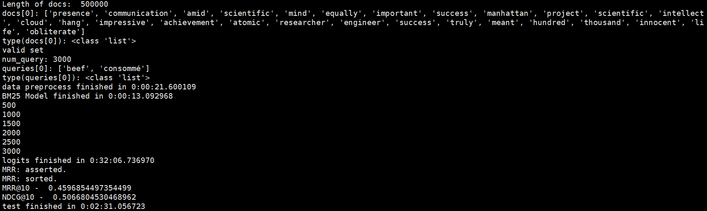
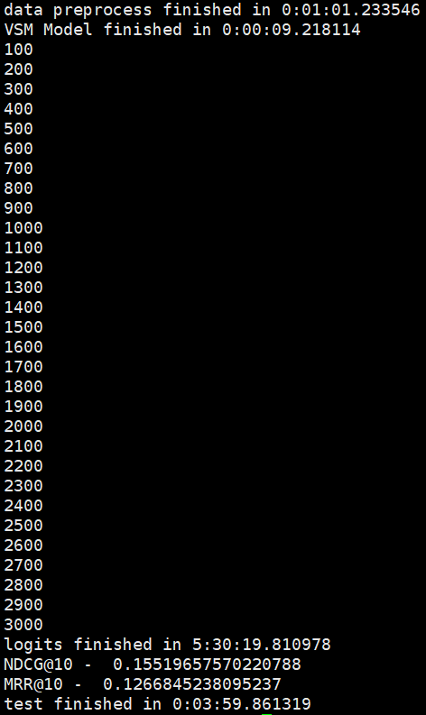

# qSearch

## 声明
本repository为sdu信息检索技术的课程实验。  
实验中使用到的data/目录下的数据集以及bm25.py示例模型由山东大学信息检索实验室提供。  
sdu Zacky Lee  
2020/6/13  

## 一. 数据获取

实验所需数据在课程网站上给出，包含四个数据文件，格式如下。

| 文件名称                | 格式                                                         |
| ----------------------- | ------------------------------------------------------------ |
| `documents.json`        | {  d1_id:  d1_text, d2_id: d2_text, ... }                    |
| `trainingset.json`      | {  queries: {q1_id: q1_text, q2_id: q2_text, ...},   labels: {q1_id: [dx_id,...], q2_id2: [dx_id,...], ...} } |
| `validationset.json`    | {  queries: {q1_id: q1_text, q2_id: q2_text, ...},   labels: {q1_id: [dx_id,...], q2_id2: [dx_id,...], ...} } |
| `testset_no_label.json` | {  queries: {q1_id: q1_text, q2_id: q2_text, ...}, }         |

 

## 二. 程序编写

本信息检索模型使用`BM25`模型作为基础，同时对文本进行了去除停用词、词形还原等文本预处理操作，最终使用`MRR@10`和`NDCG@10`指标对检索结果进行评价。

###  文本预处理

#### 1. 文档转小写
在进行文本预处理时，首先需要借助`lower()`函数，将文本内容全部转为小写字符，便于处理。

#### 2. 分词
分词借助`nltk`库提供的函数实现。  
```python
doc = nltk.word_tokenize(doc.lower()) 
```

#### 3. 停用词去除
停用词的去除借助了`nltk`库提供的英文停用词库，并在此基础上手动去除了常见的英文标点符号。
```python
en_stopwords = nltk.corpus.stopwords.words('english') 
en_stopwords.extend([',', '.', ':', ';', '?', '(', ')', '[', ']', '&', '!', '*', '@', '#', '$', '%']) 
doc = [w for w in doc if w not in en_stopwords]   # 去除停用词和标点 
```

#### 4. 词形还原Lemmatization
与lemmatization相比，stemming是简单的轻量级的词形归并方式，最后获得的结果为词干，因此并不一定具有实际意义。  
lemmatization处理相对复杂，获得结果为词的原形，能够承载一定意义，因此在本实验中，使用lemmatization。  
本实验中的lemmatization使用`nltk`库提供的`WordNetLemmatizer`工具。由于使用该工具需要手动指定每个词的词性`pos`，否则还原效果较差，因此还需要额外的函数进行词性标注。  
```python
# 获取Lemmatization需要的词性
def get_wordnet_pos(treebank_tag):
	if treebank_tag.startswith('J'):
		return nltk.corpus.wordnet.ADJ
	elif treebank_tag.startswith('V'):
		return nltk.corpus.wordnet.VERB
	elif treebank_tag.startswith('N'):
		return nltk.corpus.wordnet.NOUN
	elif treebank_tag.startswith('R'):
		return nltk.corpus.wordnet.ADV
	else:
		return None

def lemmatize_doc(doc):
	res = []
	lemmatizer = nltk.stem.WordNetLemmatizer()
	for word, pos in nltk.pos_tag(doc):
		wordnet_pos = get_wordnet_pos(pos) or nltk.corpus.wordnet.NOUN
		res.append(lemmatizer.lemmatize(word, pos=wordnet_pos))
	return res
```

###  文档读取加速
由于`documents.json`内部包含50万个文档，因此每次“打开文档—读取数据—文本预处理”的过程是较慢的。  
因此可以考虑创建中间文档，存储原文档在文本预处理之后的内容，在之后需要读取文档时，只需要读取修改之后的文档，而不需要重复进行文本预处理操作。  

`get_data(is_modi)`读取数据函数通过判断参数`is_modi`的布尔值，决定读取原文件`documents.json`或修改后的文件`modi_documents.json`。  

以下代码为`get_data(is_modi)`函数中，读取文档信息的部分。  
```python
if is_modi == False:
	f_d = json.load(open("data/documents.json", 'r', encoding="utf-8", errors="ignore"))
	for key in f_d:
		docs.append(tokenizer(f_d[key]))
		docs_id[key] = num      # num是编号，key是json.load()转换成字典之后的key
		num += 1
	num_doc = num
	json_f = dict(zip(docs_id.keys(), docs))
	json_f = json.dumps(json_f)
	with open("data/modi_documents.json", 'w') as json_file:
		json_file.write(json_f)
else:
	f_d = json.load(open("data/modi_documents.json", 'r', encoding="utf-8", errors="ignore"))
	for key in f_d:
		docs.append(f_d[key])
```

###  BM25模型类
类中主要包含需要的数据变量，以及用于计算文本之间相似度的函数。  

#### 1. 成员变量
成员变量主要是用于bm25模型中计算相关的变量，包括`tf`, `idf`等值以及控制变量`k1`和`b`。
```python
self.D = len(docs)
self.avgdl = sum([len(doc)+0.0 for doc in docs]) / self.D   # 平均每个doc有多少单词
self.docs = docs
self.f = []     # 列表的每一个元素是一个dict，dict存储着一个文档中每个词的出现次数
self.df = {}    # 存储每个词及出现了该词的文档数量
self.idf = {}   # 存储每个词的idf值
self.k1 = 1.2
self.b = 0.75
```

#### 2. 初始化函数
初始化函数主要是计算文档中term的`tf`和`idf`的值，用于之后代入bm25模型中计算相似度。  
```python
def init(self):
	for doc in self.docs:
		tmp = {}
		for word in doc:
			tmp[word] = tmp.get(word, 0) + 1  # 存储每个文档中每个词的出现次数
		self.f.append(tmp)
		for k in tmp.keys():
			self.df[k] = self.df.get(k, 0) + 1
	for k, v in self.df.items():
		self.idf[k] = math.log(self.D) - math.log(v + 1)
```

#### 3. 相似度计算
bm25模型的相似度计算公式如下：  
  
其中，`b`的取值控制文档的长度与平均长度的比值对结果的影响，此处取`0.75`；`k1`是用来帮助确定词频饱和特征点的，它限制了单一的查询term能够对给定文档的得分有多大程度的影响，此处取`1.2`。  
根据以上公式，得出计算文档相似度的代码如下：

```python
def sim(self, doc, index):
	score = 0
	for word in doc:
		if word not in self.f[index]:
			continue
		d = len(self.docs[index])
		score += (self.idf[word]*self.f[index][word]*(self.k1+1)
				/ (self.f[index][word]+self.k1*(1-self.b+self.b*d
								/ self.avgdl)))
	return score
```

## 三. 检索评价
使用`documents.json`中50万个文档与`validationset.json`中`3000`个查询进行测试，以`MRR@10`和`NDCG@10`作为评价指标，得到结果如下：  
- `MRR@10: 0.4597`
- `NCDG@10: 0.5067`
  
可以发现，该模型对于文档之间相似度计算的效果较好。

## 四. 尝试其他模型
尝试使用的另一种模型是利用`VSM`的余弦相似度计算文档与查询之间的相似度，以`tf-idf`值作为向量分量的取值，但由于文档和查询数目过多，直接使用的时间和空间花费都极大。  
将向量维度降低到`10`维，可以适当减少时间和空间的开销，但相较`BM25`模型而言，花费仍然极大，且效果较差。  

